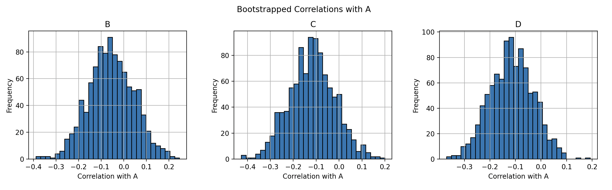

# Correlation

```python 
import pandas as pd
import numpy as np

import bootstrap

# Generate some data
data = np.random.normal(loc=[0, 5, 10, 25], size=(100, 4))
df = pd.DataFrame(data, columns=["A", "B", "C", "D"])

def correlation_with_a(df: pd.DataFrame) -> pd.Series:
    """Correlation between column A and others"""
    return df.corr().loc["A", "B":]

df_bootstrap = df.boot.get_samples(bfunc=correlation_with_a, B=1000)
```

