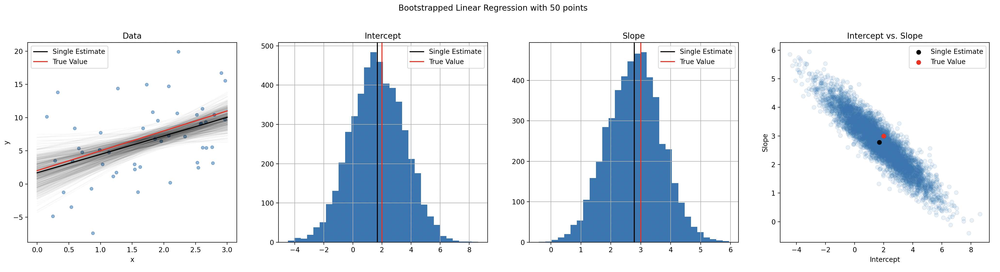

# Linear Regression Confidence Intervals

```python
import pandas as pd
import numpy as np

from sklearn.linear_model import LinearRegression

import bootstrap

N_POINTS = 50

SLOPE = 3
INTERCEPT = 2
SIGMA = 5

df = pd.DataFrame({
    "x": np.random.uniform(0, 3, size=N_POINTS)
})
df["y"] = (
    INTERCEPT
    + SLOPE * df["x"]
    # Noise
    + np.random.normal(loc=0, scale=SIGMA, size=N_POINTS)
)

def bfunc(df: pd.DataFrame, model: LinearRegression) -> pd.Series:
    model.fit(df[["x"]], df["y"])

    return pd.Series({
        "intercept": model.intercept_,
        "slope": model.coef_[0]
    })

B = 5_000
model = LinearRegression()
df_bootstrap = df.boot.get_samples(bfunc=bfunc, B=B, model=model)
```

which results in:

```text
        intercept     slope
sample
0       -0.369922  2.985659
1       -0.139439  3.312337
2       -1.878551  3.981249
3       -0.080539  2.888800
4       -0.679095  4.191550
```


