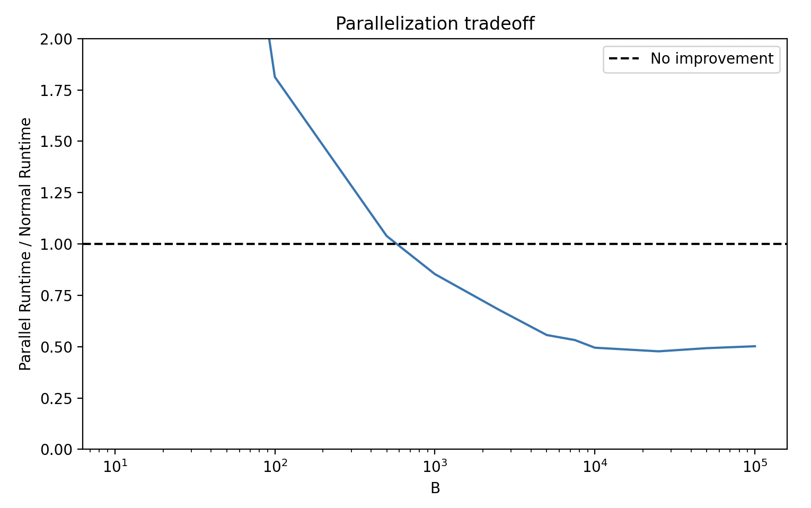

A `joblib.Parallel` instance can be passed in order to parallelize the bootstrapping process. See the [joblib documentation](https://joblib.readthedocs.io/en/latest/parallel.html) for more information.

```python
from joblib import Parallel

parallel = Parallel(n_jobs=-1)

def some_func(df: pd.DataFrame) -> pd.Series:
    return df.mean(numeric_only=True)

df_samples = df.boot.get_samples(bfunc=some_func, B=100, parallel=parallel)
```

Be aware that time improvement is not guaranteed. The overhead of parallelization may outweigh the benefits of parallelization. We see that a parallelized version of the function is not always faster than the non-parallelized version. However, this will depend on the machine and the configuration of the `joblib.Parallel` instance.


